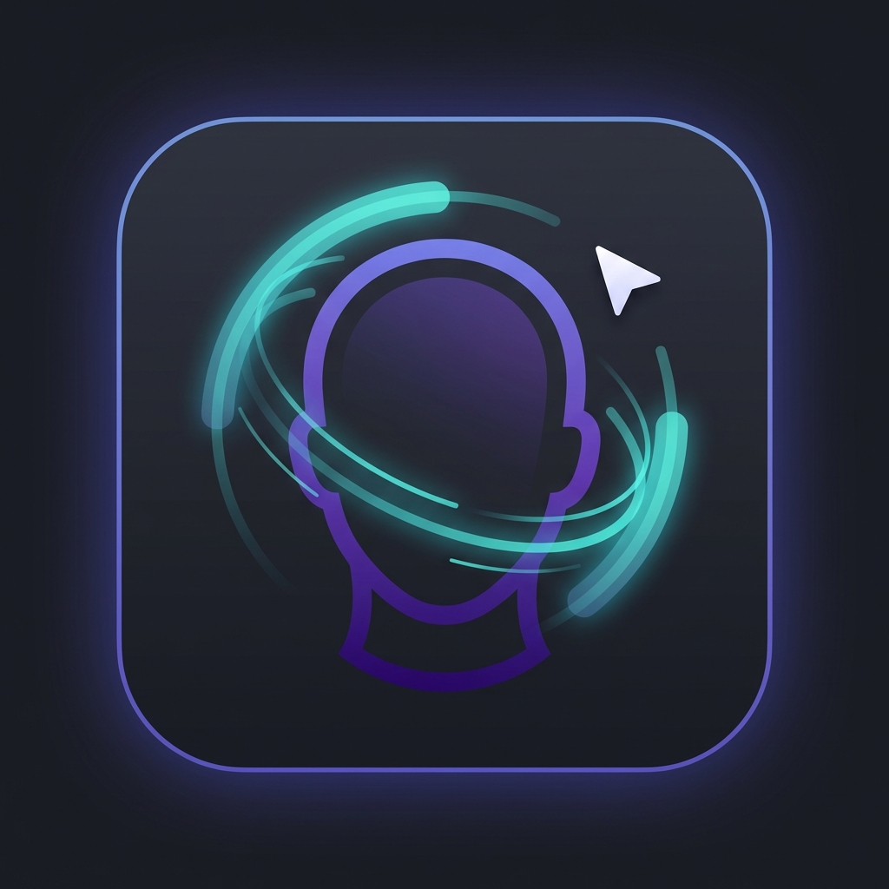

# HandsFreeWeb

> **Browse the web without touching your keyboard or mouse**

HandsFreeWeb is a Chrome extension that enables hands-free web browsing using head tracking and on-device AI. Control your cursor with head movements, click by opening your mouth, and get instant AI-powered summaries of any link — all processed locally on your device.



---

## Why HandsFreeWeb?

**For millions of people**, using a traditional mouse and keyboard is painful, difficult, or impossible:

- People with mobility impairments, ALS, cerebral palsy, or RSI
- Anyone recovering from surgery or temporary injury
- Users who simply want to browse while doing other tasks

**Existing solutions are expensive and invasive:**

- Eye-gaze systems cost $10,000+
- Most require specialized hardware
- Many send your data to cloud servers

**HandsFreeWeb is different:**

- ✅ **Free** — works with any webcam
- ✅ **Private** — everything runs locally on your device
- ✅ **Simple** — just install and calibrate

---

## Features

### 🎯 Head-Controlled Cursor

Move your head to control the cursor. The extension uses advanced computer vision to track your facial movements with smooth, jitter-free precision.

- **Look left/right** → cursor moves horizontally
- **Tilt up/down** → cursor moves vertically
- **5-point calibration** adapts to your natural range

### 👄 Mouth-Click Detection

Open your mouth to click. No hands needed.

- Calibrated to your facial structure
- 800ms cooldown prevents accidental double-clicks
- Real-time visual feedback

### ⏱️ Dwell-to-Click

Hover on any element to automatically click it.

- Visual progress ring shows countdown
- Magnetic snapping helps target small links
- Configurable timing (300-1500ms)

### 📜 Smart Navigation Zones

- **Top/bottom edges** → auto-scroll
- **Left edge** → browser back
- **Right edge** → browser forward

### 🤖 AI Link Summaries

Hover over any link to get an instant AI summary — no need to click through just to preview content.

- Works on articles, news, Wikipedia, and more
- YouTube video summaries from captions
- Powered by Chrome's on-device Gemini Nano
- Real-time streaming responses

---

## Installation

### Requirements

- **Chrome Dev or Canary** (version 128+)
- A webcam

### Step 1: Enable Chrome AI

1. Go to `chrome://flags/#optimization-guide-on-device-model` → Set to **"Enabled BypassPerfRequirement"**
2. Go to `chrome://flags/#prompt-api-for-gemini-nano` → Set to **"Enabled"**
3. Go to `chrome://flags/#summarization-api-for-gemini-nano` → Set to **"Enabled"**
4. Restart Chrome

### Step 2: Install Extension

```bash
git clone https://github.com/priyanshuharshbodhi1/Hands-Free-Web.git
cd Hands-Free-Web
```

1. Open `chrome://extensions/`
2. Enable **Developer mode**
3. Click **Load unpacked** and select the folder
4. Allow camera access when prompted

---

## Quick Start

### 1. Enable Head Tracking

Click the extension icon → Toggle **"Enable Head Tracking"** → Grant camera permission

### 2. Calibrate

Press `Alt+H` and follow the 5-point calibration:

1. Look at **CENTER** → press SPACE
2. Look **LEFT** → press SPACE
3. Look **RIGHT** → press SPACE
4. Look **UP** → press SPACE
5. Look **DOWN** → press SPACE

Your cursor now follows your head movements!

### 3. Optional: Enable Mouth Clicking

Toggle **"Enable Mouth Click"** → Press `Alt+M` to calibrate

### Keyboard Shortcuts

| Shortcut | Action                   |
| -------- | ------------------------ |
| `Alt+H`  | Calibrate head tracking  |
| `Alt+M`  | Calibrate mouth clicking |
| `Esc`    | Cancel active summary    |

---

## How It Works

### Head Tracking Pipeline

```
Webcam → Face Detection (Human.js) → 468 Facial Landmarks
→ Head Pose Estimation → One-Euro Filter → Screen Coordinates
→ Dwell Detection → Click/Scroll/Navigate
```

### AI Summary Pipeline

```
Link Hover → Fetch Page → Extract Content (Readability.js)
→ Chrome Summarizer API → Gemini Nano → Display
```

---

## Tech Stack

| Component          | Technology                                                            |
| ------------------ | --------------------------------------------------------------------- |
| Face Detection     | [Human.js](https://github.com/vladmandic/human) (468-point landmarks) |
| Signal Smoothing   | One-Euro Filter                                                       |
| Content Extraction | [Readability.js](https://github.com/mozilla/readability)              |
| AI Processing      | Chrome Built-in AI (Gemini Nano)                                      |
| Extension          | Manifest V3                                                           |

---

## Troubleshooting

**Cursor is jittery?**

- Improve lighting (face the light source)
- Recalibrate with `Alt+H`
- Keep your torso stable

**AI summaries not working?**

- Verify Chrome flags are enabled
- Run `await ai.summarizer.availability()` in DevTools — should return `"readily"`
- Wait 5-10 min for model download on first use

**Mouth clicks not registering?**

- Recalibrate with `Alt+M`
- Exaggerate your mouth opening during calibration

---

## Use Cases

| Who                       | How                                                      |
| ------------------------- | -------------------------------------------------------- |
| ♿ **Accessibility**      | Full browser control for users with mobility impairments |
| 🤕 **RSI Prevention**     | Rest your hands while continuing to browse               |
| 🩹 **Temporary Injuries** | Browse with a broken arm or after surgery                |
| 🍕 **Multitasking**       | Browse while eating, cooking, or working out             |
| 📚 **Research**           | Preview links without losing your place                  |

---

## Project Structure

```
Hands-Free-Web/
├── manifest.json          # Extension config
├── background.js          # AI processing
├── content.js             # Link detection, tooltips
├── sidepanel.js/html/css  # Settings UI
├── gaze/                  # Head tracking system
│   ├── gaze-core.js       # Computer vision
│   ├── gaze-dwell.js      # Dwell detection
│   ├── head-cal.js        # Head calibration
│   └── mouth-cal.js       # Mouth calibration
├── youtube/               # YouTube caption extraction
└── lib/                   # Third-party libraries
```

---

## Contributing

Contributions welcome!

1. Fork the repository
2. Create a feature branch: `git checkout -b feature/your-feature`
3. Commit your changes
4. Push and open a Pull Request

---

## License

MIT License — see [LICENSE](LICENSE) for details.

---

## Acknowledgments

- [Human.js](https://github.com/vladmandic/human) — Face tracking
- [Readability.js](https://github.com/mozilla/readability) — Content extraction
- [One-Euro Filter](https://cristal.univ-lille.fr/~casiez/1euro/) — Signal smoothing

---

<div align="center">

**Browse hands-free. Understand faster.**

</div>
